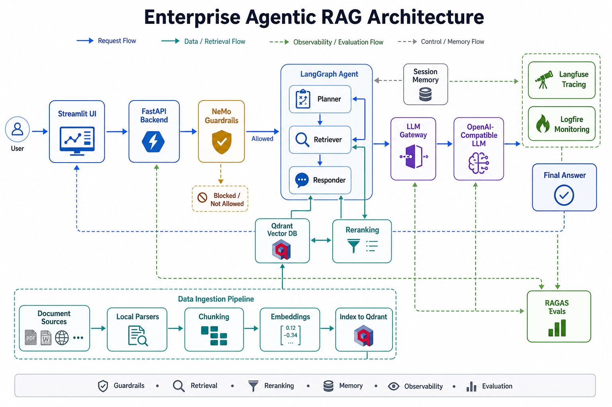
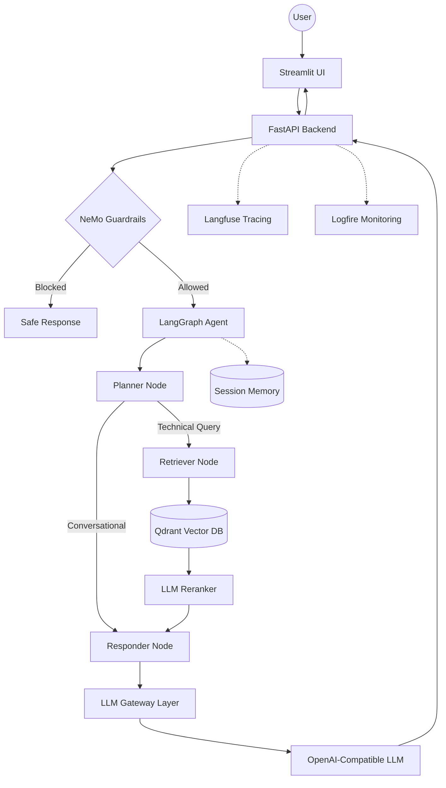

# Enterprise Agentic RAG Assistant

A production-style Agentic RAG system for enterprise document intelligence. It combines a FastAPI backend, LangGraph agent workflow, Qdrant vector search, NeMo Guardrails, LLM-based reranking, Langfuse tracing, Logfire monitoring, Streamlit UI, and an evaluation pipeline.

This project is designed as an interview-ready backend + AI systems showcase: it demonstrates how a real RAG application can separate UI, API, retrieval, guardrails, observability, ingestion, and evaluation into clean modules.



---

## What This Project Does

The assistant answers questions from a curated technical documentation corpus while filtering unsafe/off-topic input, retrieving relevant chunks, reranking context, generating grounded answers, and tracing the full request path.

Core flow:

```text
User -> Streamlit UI -> FastAPI /query -> Guardrails -> LangGraph Agent
     -> Planner -> Retriever -> Qdrant -> Reranker -> Responder -> LLM
     -> Final Answer + Sources + Trace
```

---

## Key Features

- **Agentic RAG workflow**: LangGraph planner, retriever, and responder nodes.
- **Guardrails before retrieval**: NeMo Guardrails checks the user request before expensive search/LLM calls.
- **Vector search**: Qdrant Cloud stores indexed document chunks and serves semantic retrieval.
- **LLM-based reranking**: retrieved chunks are reranked before answer generation.
- **Session memory**: LangGraph `MemorySaver` keeps conversation context by `thread_id`.
- **Central LLM gateway layer**: all main generation calls go through `app/gateway`.
- **Observability**: Langfuse traces request-level spans and LLM calls; Logfire captures backend events.
- **Document ingestion**: local parsers handle PDF, HTML, TXT, DOCX, and PPTX files.
- **Evaluation suite**: RAGAS/custom evaluation pipeline for checking answer quality.
- **Deployment-ready backend**: Dockerfile for container platforms and `api/index.py` + `vercel.json` for Vercel.

---

## Architecture



---

## Tech Stack

| Layer | Technology |
| --- | --- |
| Backend API | FastAPI, Uvicorn |
| Agent orchestration | LangGraph, LangChain |
| LLM interface | OpenAI-compatible API, LangChain OpenAI |
| Vector database | Qdrant Cloud |
| Guardrails | NeMo Guardrails |
| Reranking | LLM-based reranker |
| Observability | Langfuse, Pydantic Logfire |
| UI | Streamlit |
| Evaluation | RAGAS-style evaluation pipeline, custom metrics |
| Deployment | Docker, Vercel serverless adapter |

---

## Project Structure

```text
.
+-- app/
|   +-- agents/
|   |   +-- graph.py
|   |   +-- state.py
|   |   +-- nodes/
|   |       +-- planner.py
|   |       +-- retriever.py
|   |       +-- responder.py
|   +-- gateway/
|   |   +-- client.py
|   +-- guardrails/
|   |   +-- rails.py
|   |   +-- colang_rules.py
|   +-- ingestion/
|   |   +-- processor.py
|   |   +-- chunking/
|   |   +-- loaders/
|   +-- services/
|   |   +-- retrieval/
|   +-- config.py
|   +-- main.py
+-- api/
|   +-- index.py
+-- ui/
|   +-- app.py
+-- evals/
+-- DOCS/
+-- DATA/
+-- Dockerfile
+-- vercel.json
+-- requirements.txt
+-- requirements-prod.txt
```

---

## Environment Variables

Create a `.env` file locally, or set these values in your deployment platform.

```env
# LLM provider
OPENAI_API_KEY=
OPENAI_BASE_URL=
LLM_MODEL=nvidia/nemotron-3-ultra-550b-a55b
OPENAI_EMBEDDING_MODEL=text-embedding-3-large

# Qdrant
QDRANT_CLUSTER_ENDPOINT=
QDRANT_API_KEY=

# Observability
LANGFUSE_PUBLIC_KEY=
LANGFUSE_SECRET_KEY=
LANGFUSE_BASE_URL=https://cloud.langfuse.com
LOGFIRE_TOKEN=

# Streamlit UI
BACKEND_URL=http://localhost:8000

# Evaluation
JUDGE_GROQ=
```

---

## Local Setup

### 1. Create and activate a virtual environment

```powershell
python -m venv .venv
.\.venv\Scripts\activate
```

### 2. Install dependencies

```powershell
pip install -r requirements.txt
```

### 3. Ingest documents into Qdrant

```powershell
python -m app.ingestion.processor DATA --wipe
```

Use `--wipe` when you want to recreate the Qdrant collection from scratch.

### 4. Run the backend

```powershell
uvicorn app.main:app --reload --port 8000
```

Backend health check:

```text
http://localhost:8000/
```

### 5. Run the Streamlit UI

```powershell
streamlit run ui/app.py
```

---

## API Usage

Send a query to the backend:

```bash
curl -X POST http://localhost:8000/query \
  -H "Content-Type: application/json" \
  -d "{\"q\":\"How do Kubernetes CronJobs work?\",\"thread_id\":\"demo-user\"}"
```

Response shape:

```json
{
  "question": "How do Kubernetes CronJobs work?",
  "answer": "Generated answer...",
  "thought_process": ["Intent: Technical", "Context Retrieved"],
  "status": "Response generated.",
  "sources": ["CONTENT: ..."]
}
```

---

## Evaluation

Run the evaluation dashboard:

```powershell
streamlit run evals/app.py
```

The evaluation suite is separated from the live backend so experiments and judge-model calls do not interfere with the production request path.

---

## Deployment

### Container Platforms

Use the included Dockerfile for Render, Railway, Fly.io, or Cloud Run style deployments:

```bash
docker build -t enterprise-agentic-rag .
docker run -p 8080:8080 --env-file .env enterprise-agentic-rag
```

### Vercel Backend

This repo also includes:

- `api/index.py`
- `vercel.json`
- `.vercelignore`
- `requirements-prod.txt`

Set the required environment variables in Vercel, then deploy the repository. The FastAPI app is exposed through the Vercel Python function entrypoint.

---

## Documentation

| Guide | Description |
| --- | --- |
| [System Overview](DOCS/01_SYSTEM_OVERVIEW.md) | End-to-end system flow |
| [Ingestion Engine](DOCS/02_INGESTION_ENGINE.md) | Document parsing and chunk indexing |
| [Node Intelligence](DOCS/03_NODE_INTELLIGENCE.md) | Planner, retriever, responder internals |
| [Tracing and Observability](DOCS/04_TRACING_AND_OBSERVABILITY.md) | Logfire and tracing design |
| [Environment Variables](DOCS/05_ENVIRONMENT_VARIABLES.md) | Configuration reference |
| [Known Gotchas](DOCS/06_KNOWN_GOTCHAS.md) | Bugs, fixes, and design notes |
| [Reranking](DOCS/07_FLASHRANK_RERANKING.md) | Reranking strategy |
| [Guardrails](DOCS/08_GUARDRAILS.md) | NeMo Guardrails implementation |
| [LLM Gateway](DOCS/09_LLM_GATEWAY.md) | Gateway abstraction and routing |
| [Evals](DOCS/10_EVALS.md) | Evaluation theory and metrics |
| [Evals Pipeline](DOCS/11_EVALS_PIPELINE.md) | Live evaluation workflow |

---

## Interview Summary

This project demonstrates how to build an enterprise-style RAG system with clean separation between UI, API, agent orchestration, retrieval, guardrails, observability, and evaluation.

It is demo-ready and deployment-ready for portfolio/interview use. For a public production rollout, the next hardening steps would be authentication, rate limiting, CI tests, stricter dependency pinning, and deployment monitoring.
